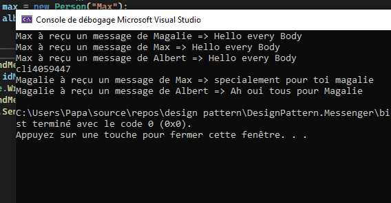

# Etude de cas 
## Le singleton : messenger
Une petite etude de cas sur le singleton a travers un petit exemple de messagerie.

* Emploi d'instance unique (singleton).
* Une class $${\color{green}MyMessenger}$$ et ses $${\color{blue}methodes}$$ 
    * Un $${\color{blue}Register}$$
        * broadcast 
        * private
    * Le $${\color{blue}UnRegister}$$  unique.
    * Le $${\color{blue}SendMessage}$$  selon le Register
        * En Broadcast
        * Ou en salle privée
    * Une fonction $${\color{blue}GetUserName}$$  qui va nous permettre de retrouver le nom <br>
    des utilisateurs grâce a leur reference ID
    #

    >### **A NOTER** 
    >>L'emploie de lock pour securisier les données et empêcher les autres thread.
    

* Une Class $${\color{green}Person}$$
    * avec deux variables {Nom , Id}
        * Id est realiser grace a
        ```
         cli"+Random.Shared.Next(1000, 10000000).ToString()
        ```
    * On delegate la fonction $${\color{blue}Receive}$$ de chaque person 

    * On creer la fonction $${\color{blue}Receive**}$$
    * On créer la fonction $${\color{blue}SendMessage}$$   

>## Au final on test notre petite application
```
Person magalie = new Person("Magalie");
Person max = new Person("Max");
Person albert = new Person("Albert");

max.SendMessage(message:"Hello every Body");
string idMagalie = magalie.Id;
Console.WriteLine(idMagalie);
max.SendMessage(message:"specialement pour toi magalie",idFriend:idMagalie);
albert.SendMessage(message: "Ah oui tous pour Magalie", idFriend: idMagalie);
```
et on obtient



## Conclusion
Je sais que max reçois son propre message mais c'est dans l'optique d'un chat, et donc vous revecez bien votre message aussi ;)
